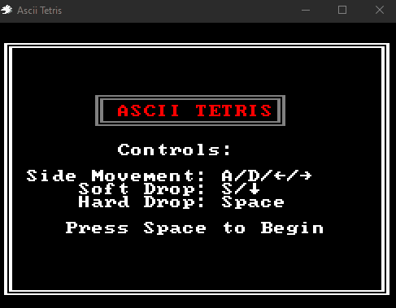

# Bevy Ascii Tetris

A simple ecs implementation of Tetris built in [Bevy](https://bevyengine.org/) using [Bevy Ascii Terminal](https://github.com/sarkahn/bevy_ascii_terminal) for rendering.

---

*Click the gif to play the wasm build*

